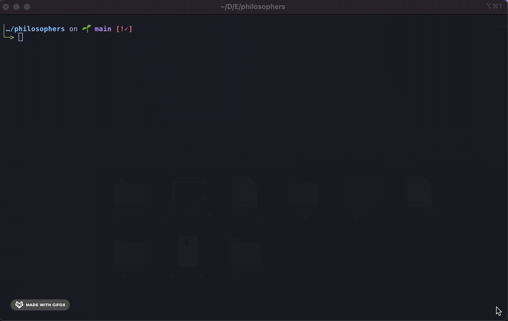

# About
How to feed and put to bed philosophers alternatively without them dying in the meanwhile? This repo contains my implementation of the dining philosophers problem: Philosophers are sitting around a table to have dinner. In front of them are two forks, and philosophers need to grab two forks to be able to eat. However each fork is shared by two philosophers which means that philosophers sitting next to each other can't eat in the same time. Each philosopher is represented by a thread, and all threads are synchronised to execute a routine while avoiding to step in each others way (data races and dead locks). Find a detail description here: [subject.pdf](https://github.com/Axel-ex/philosophers/blob/main/subject.pdf)

# Usage
`git clone` this project `cd` into it and `make`. for debug formating and colored output `make MODE=debug`.
the program is executed as so:

```shell
./philo <nb_philos> <time_to_die> <time_to_eat> <time_to_sleep> (optional) <nb_of_meal_to_eat>
```



The program will then display the actions executed by the philosophers and simulation will stop once one philosopher will die, once all of them will have eat enough (if nb_of_meal_to_eat is specified), or will never stop if `time_to_die` > `time_to_eat` + `time_to_eat`.

# Implementation
Here, each philosopher is represented by a thread, and a supplementary thread is constently checking on them to see if all of them ate enough or if one of them died.
The key idea here was to create mutexes to avoid data races occuring when threads (running simultaneously) are trying to write in memory while other threads try to read that memory space. The idea was to create three mutexes:
	- A mutex **write_m** locking the access to stdout (philos trying to access stdout simultaniously)
	- A mutex **prog_m** locking the access to data contained in t_prog (monitor trying to write to stop flag while philos are trying to read it's value to know if the simulation ended).
	- Mutexes **philo_m** locking the access to data contained in t_philo (philos writing the time of their last meal and the number of time they ate while the monitor routine checks for those values to know when to stop the routine)
As so, everytime that a ressource is accessed, the corresponding mutex is locked before and then unlocked.
